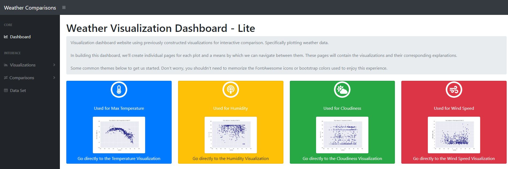
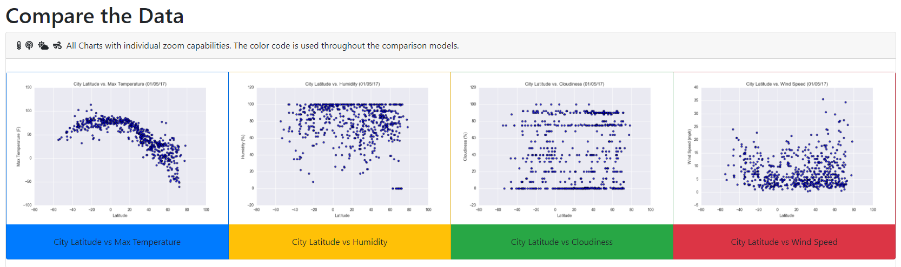
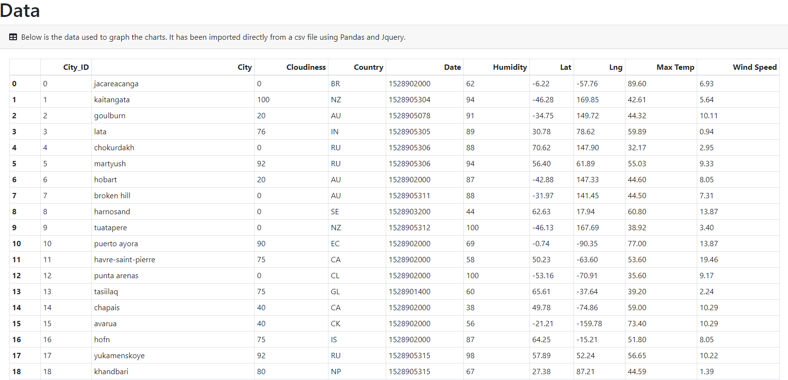
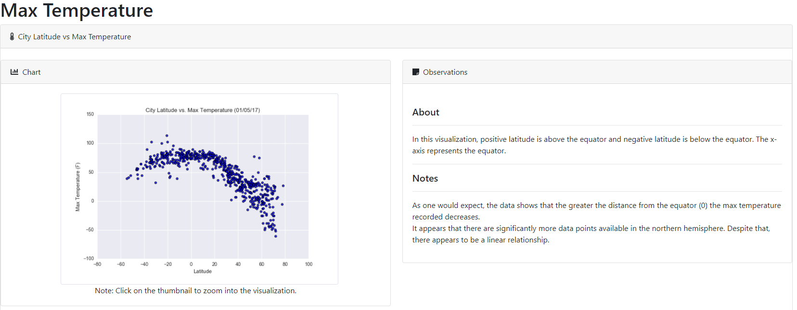
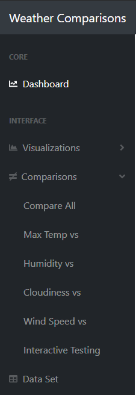

# Web Visualization Dashboard - Lite

## Background

Create a website to visually compare data from a CSV file. The CSV file has been provided by the end user.
The original CSV file (cities.csv) can be found in the Resoruces folder.

### Website Requirements

The website must consist of the following:

* A [landing page](#landing-page) containing:
  * An explanation of the project.
  * Links to each visualizations page. There should be a sidebar containing preview images of each plot, and clicking an image should take the user to that visualization.
* Four [visualization pages](#visualization-pages), each with:
  * A descriptive title and heading tag.
  * The plot/visualization itself for the selected comparison.
  * A paragraph describing the plot and its significance.
* A ["Comparisons" page](#comparisons-page) that:
  * Contains all of the visualizations on the same page so we can easily visually compare them.
  * Uses a Bootstrap grid for the visualizations.
    * The grid must be two visualizations across on screens medium and larger, and 1 across on extra-small and small screens.
* A ["Data" page](#data-page) that:
  * Displays a responsive table containing the data used in the visualizations.
    * The table must be a bootstrap table component.
    * The data must come from exporting the `.csv` file as HTML, or converting it to HTML. 

The website must, at the top of every page, have a navigation menu that:

* Has the name of the site on the left of the nav which allows users to return to the landing page from any page.
* Provides two more text links: "Comparisons," which links to the comparisons page, and "Data," which links to the data page.
* A breakdown of the individual charts would be nice, but is not required.
* Is responsive.

### Considerations

* The images can be found here: [assets folder](Resources/assets/images).
* Bootstrap is required.
* Deploy the website to GitHub pages, with the website working on a live, publicly accessible URL as a result.
* Use a CSS media query for the navigation menu.
* Feel free to take some liberty in the visual aspects, but keep the core functionality the same.
* Add extra visualizations! The more comparisons the better.
* Use meaningful glyphicons next to links in the header.
* Have visualization navigation on every visualizations page with an active state.

### Screenshots - Examples of expectations. 

This section contains screenshots from the end user as to the minimum expectations followed by a screenshot of the final product. This is meant to be an interactive experience, so the screenshots only show a limited view of the final product. 

---

Sample Landing Page            |  Final Landing Page
:-------------------------:|:-------------------------:
  |  

---

Sample Comparison Page            |  Final Comparison Page
:-------------------------:|:-------------------------:
  |  

---

Sample Data Page            |  Final Data Page
:-------------------------:|:-------------------------:
  |  

---

Sample Visualization Page            |  Final Visualization Page
:-------------------------:|:-------------------------:
  |  

---

Sample Navigation Menu            |  Final Navigation Menu
:-------------------------:|:-------------------------:
  |  